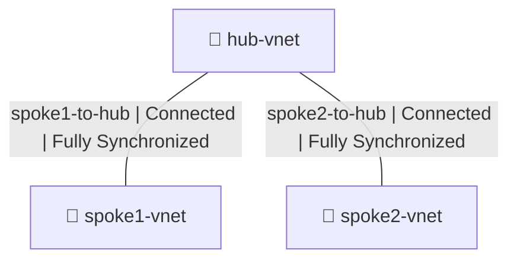

# Azure Hub-and-Spoke Network Topology

A hands-on Azure networking project demonstrating a hub-and-spoke virtual network
architecture using Azure VNet Peering. This project establishes a central hub VNet
connected to two spoke VNets, enabling controlled and scalable network segmentation
in the cloud.

> 🔧 **Terraform Automation**: The infrastructure-as-code version of this project
> lives here → [azure-hub-spoke-terraform](https://github.com/maxmagnac/azure-hub-spoke-terraform "source-reference")

---

## Network Topology

---
