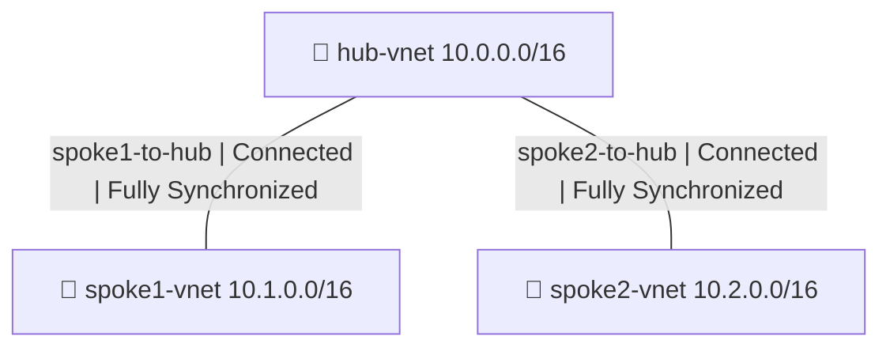

Azure-Hub-Spoke-Terraform

A Terraform automation project that deploys a Hub-and-Spoke Network Topology on Microsoft Azure. This project provisions all network infrastructure using Infrastructure as Code, demonstrating enterprise-level network design and automated deployment skills.

Architecture Overview

The hub-and-spoke topology connects a central hub virtual network to two spoke virtual networks through VNet peering. All traffic routes through the hub, simulating how enterprises isolate workloads while maintaining centralized connectivity.



Technologies Used

- Microsoft Azure
- Terraform (Infrastructure as Code)
- Azure Virtual Networks (VNet)
- VNet Peering
- Azure Resource Groups

Infrastructure Components

Resource Group

Resource Group (screenshots/01-resource-group-terraform.png)


Hub Virtual Network

Hub VNet (screenshots/02-hub-vnet-terraform.png)


Spoke 1 Virtual Network

Spoke1 VNet (screenshots/03-spoke1-vnet-terraform.png)


Spoke 2 Virtual Network

Spoke2 VNet (screenshots/04-spoke2-vnet-terraform.png)


Hub VNet Peerings

Hub VNet Peerings (screenshots/05-hub-vnet-peerings-terraform.png)


Deployment

```
git clone https://github.com/maxmagnac/azure-hub-spoke-terraform.git
cd azure-hub-spoke-terraform
terraform init
terraform plan
terraform apply
```

Related Projects

- azure-hub-spoke-network (https://github.com/maxmagnac/azure-hub-spoke-network) - Manual deployment of the same Hub-and-Spoke topology

Author: Maurrin Carter
